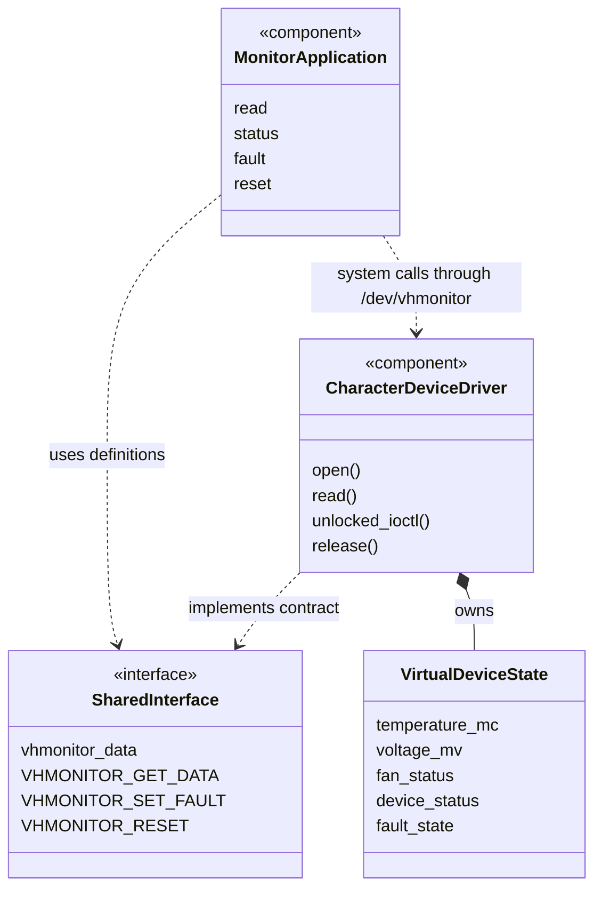
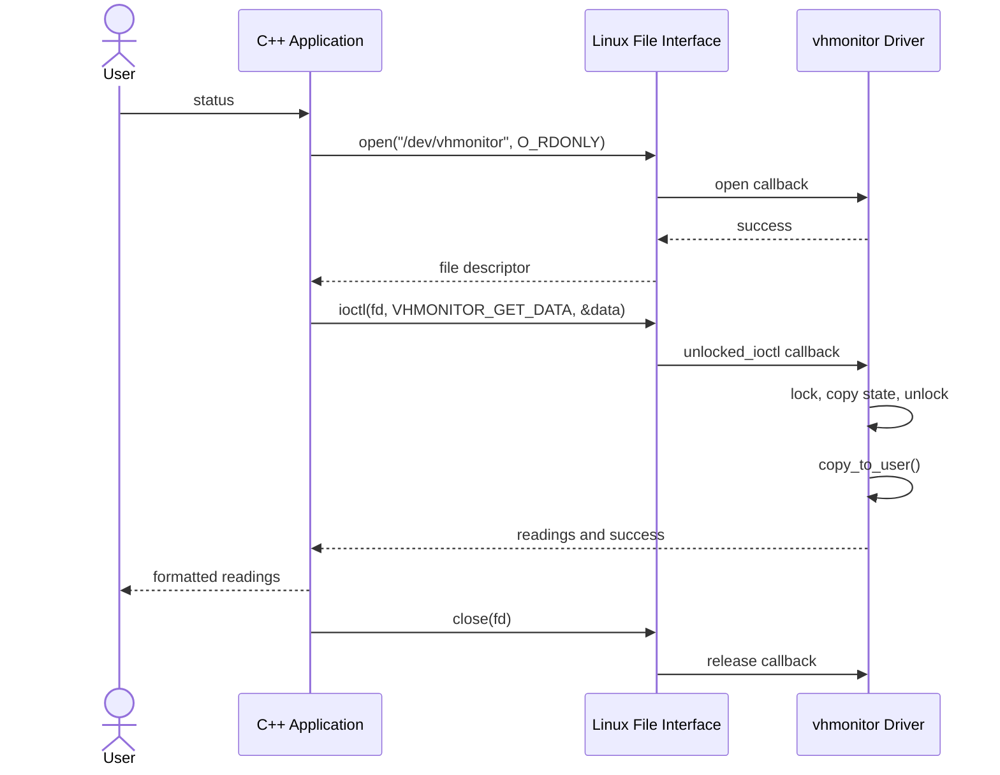

# Architecture and Design

## Purpose

This Linux-only project simulates a hardware monitoring device without
physical hardware. A C kernel module owns the virtual device state.
A C++ command-line application accesses it through /dev/vhmonitor.

## Components

| Component | Responsibility |
| --- | --- |
| driver/vhmonitor.c | Device registration, virtual state, file operations, fault handling |
| shared/vhmonitor_ioctl.h | Shared data layout, status constants, IOCTL request definitions |
| app/vhmonitor.cpp | Command validation, system calls, monitoring output |
| tests/ | C++ interface and error-path tests |
| docs/ | Design, execution guidance, and verified test results |

## UML Component Diagram

These are logical components, not literal C++ classes.

## User Space and Kernel Space

The C++ application runs in user space. The driver runs in kernel space.
A file descriptor returned by open() identifies the application's open
device handle.

read() returns formatted text. ioctl() transfers structured readings or
requests a state change. close() releases the descriptor; the driver's
release callback runs when the last reference to the open file is closed.

The driver uses copy_to_user() and copy_from_user() for IOCTL transfers.
simple_read_from_buffer() handles text copying, file-position advancement,
partial reads, and EOF.

## UML Sequence Diagram: Status Request

## Virtual Device States

Only one fault is active at a time. Each fault selection first restores
normal values, then applies the selected fault.

| State | Temperature | Voltage | Fan | Device | Fault code |
| --- | --- | --- | --- | --- | --- |
| Normal | 35 C | 12000 mV | OK | OK | 0 |
| Overheat | 95 C | 12000 mV | OK | FAILED | 1 |
| Voltage fault | 35 C | 15000 mV | OK | FAILED | 2 |
| Fan failure | 35 C | 12000 mV | FAILED | FAILED | 3 |

RESET restores normal state. Reloading the module also initializes normal
state. Fault values are demonstration values, not physical sensor readings
or universal hardware safety thresholds.

## Shared Binary Interface

vhmonitor_data contains five fixed-width 32-bit fields, totaling 20 bytes.
Temperature uses signed millidegrees Celsius. Voltage uses unsigned
millivolts. The other fields contain status and fault codes.

- GET_DATA: driver-to-application transfer using _IOR.
- SET_FAULT: application-to-driver transfer using _IOW.
- RESET: no data buffer, using _IO.

Fault and reset operations require a descriptor opened for writing.
The application uses O_RDWR for these commands and O_RDONLY for monitoring.

## Registration and Resource Lifecycle

1. Initialize normal virtual state.
2. Allocate one character-device number dynamically.
3. Initialize and register the cdev object.
4. Manually create /dev/vhmonitor using the assigned major and minor.
5. Run the application.
6. Unload the module: remove cdev, then release the device number.
7. Remove the manually created device node.

If cdev registration fails, the allocated device number is released.
The major number must be checked after loading; 239 is not hard-coded.

## Concurrency and Limits

A mutex protects shared state updates and snapshots. User-memory copies
occur after releasing the mutex.

Each read callback takes a fresh snapshot. If another process changes state
between partial reads, one open file can return text from different states.
The verified demonstration performs state changes and reads sequentially.

The implementation does not provide a 32-bit compatibility IOCTL handler.
Testing used native applications on the stated Ubuntu VM.

## Architecture Concepts Demonstrated

- Separation of user-space presentation from kernel-space device behavior.
- A shared interface contract across the privilege boundary.
- System-call dispatch through file operations.
- Device addressing through major and minor numbers.
- Protected shared state and explicit resource lifecycle management.
- Software simulation of device behavior without physical hardware,
  MMIO registers, interrupts, or DMA.
