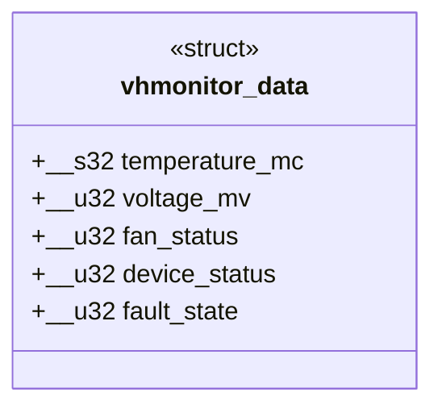

# UML Class Diagram: Shared Data Structure

## Interpretation

The implementation uses procedural C and C++ functions rather than custom
C++ classes. This UML class diagram represents the actual shared C
structure, vhmonitor_data. It does not imply an object-oriented driver
or introduce classes that do not exist in the source.

## Diagram

## Source Mapping

Definition: shared/vhmonitor_ioctl.h

| Member | Type | Meaning |
| --- | --- | --- |
| temperature_mc | __s32 | Signed temperature in millidegrees Celsius |
| voltage_mv | __u32 | Unsigned voltage in millivolts |
| fan_status | __u32 | Fan status: OK or FAILED |
| device_status | __u32 | Device status: OK or FAILED |
| fault_state | __u32 | NONE, OVERHEAT, VOLTAGE, or FAN |

All fields are 32 bits. The verified structure size is 20 bytes.
The structure has no methods, pointers, inheritance, or dynamic allocation.

## Instances and Responsibilities

The driver defines:
- normal_state: constant baseline values.
- vhmonitor_state: mutable current device state.
- snapshot: a local copy used when returning readings.

The C++ application and tests create local vhmonitor_data objects to
receive VHMONITOR_GET_DATA results.

These are instances of the same structure, not different classes.

## Interface Relationship

VHMONITOR_GET_DATA transfers a vhmonitor_data value from the driver to
the caller's user-space buffer.

VHMONITOR_SET_FAULT accepts a separate 32-bit fault value.
VHMONITOR_RESET has no data buffer.

The shared header keeps field definitions and request codes consistent
between the driver, application, and tests.

## Related Diagrams

- architecture.md: logical components and status-request sequence.
- state-machine.md: virtual device states and transitions.
