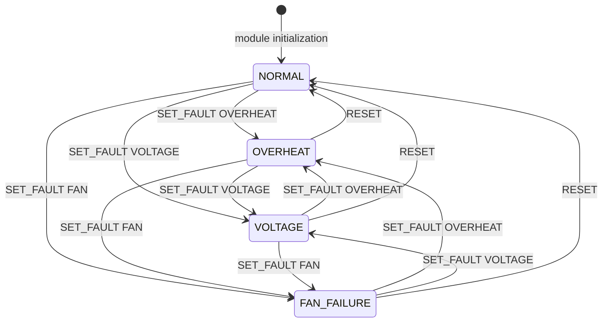

# Virtual Device State Machine

## Purpose

This diagram describes the implemented virtual device states and transitions.
Only one fault is active at a time.

## UML State Diagram

Self-transitions and module unloading are described below to keep the
diagram readable.

## State Values

| State | Temperature | Voltage | Fan | Device | Fault code |
| --- | --- | --- | --- | --- | --- |
| NORMAL | 35 C | 12000 mV | OK | OK | 0 |
| OVERHEAT | 95 C | 12000 mV | OK | FAILED | 1 |
| VOLTAGE | 35 C | 15000 mV | OK | FAILED | 2 |
| FAN_FAILURE | 35 C | 12000 mV | FAILED | FAILED | 3 |

## Transition Rules

- Loading the module initializes NORMAL.
- A valid SET_FAULT first restores normal values, then applies the selected
  fault. Therefore each fault replaces the previous one.
- Selecting the already-active fault leaves the device in that same state.
- RESET from any fault restores NORMAL.
- RESET while already NORMAL leaves the device NORMAL.
- GET_DATA and read() observe state without changing it.
- Rejected requests leave the current state unchanged.
- Module unloading ends the active device instance. State is not persisted;
  the next load initializes NORMAL again.

## Transition Guards and Errors

SET_FAULT and RESET require a descriptor opened for writing.
A read-only descriptor causes EBADF.

SET_FAULT also requires:
- A readable user-space pointer to a 32-bit fault value; otherwise EFAULT.
- A supported fault code; otherwise EINVAL.

Fault code NONE is not accepted by SET_FAULT. Use RESET to restore normal
state.

Unsupported IOCTL commands return ENOTTY.
GET_DATA with an invalid output destination returns EFAULT.

## Synchronization

The driver holds its mutex while replacing or resetting state.
GET_DATA and each read callback obtain a state snapshot under that mutex.

This does not guarantee a single snapshot across multiple partial read
calls when another process changes state between calls.

## Verification Evidence

The verified functional sequence was:
NORMAL -> OVERHEAT -> VOLTAGE -> FAN_FAILURE -> NORMAL.

Both read() and IOCTL status were verified at each stage.
The error-path test verified that rejected requests preserve OVERHEAT and
that a valid reset restores NORMAL.

Other transitions shown follow the implemented command handling; this
document does not claim every transition was independently runtime-tested.
